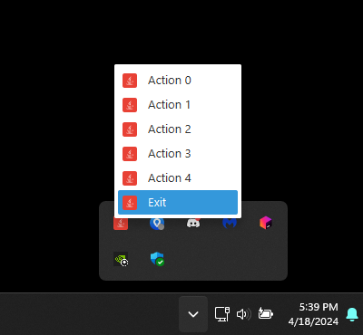

# NiceTrayIcon

**NiceTrayIcon** is a customizable tray icon system for JavaFX applications running on Windows. It has been specifically tested on Windows 11 and offers a fully CSS-styleable interface utilizing JavaFX's `ContextMenu` for straightforward integration.

## Features

- **CSS Styleable:** Allows for full customization using CSS to style the tray icon.
- **JavaFX ContextMenu:** Utilizes JavaFX's `ContextMenu` for easy integration.
- **Windows Compatibility:** Designed and tested exclusively for Windows 11 environments.

## Example Usage

To incorporate NiceTrayIcon into your JavaFX application, use the following Java code snippet:

```java
import javafx.application.Platform;
import javafx.stage.Stage;

public class Main {
    
    private static NiceTrayIcon icon;
    
    public void start(Stage stage) {
        // Load your custom image for the tray icon, 16x16 is best
        var image = new Image("path/to/your/image.png");

        // Initialize the NiceTrayIcon
        icon = new NiceTrayIcon(image);

        // Add your CSS file for styling
        icon.getStyleSheets().add("path/to/your/styles.css");

        // Install the icon in the system tray
        icon.install();

        // Build and set the context menu
        icon.setContextMenu(buildContextMenu());

        // This will prevent the JavaFX Platform from exiting when closing the Stages
        Platform.setImplicitExit(false);

        // Show your primary stage
        stage.show();
    }

    private ContextMenu buildContextMenu() {
        ContextMenu c = new ContextMenu();        
        for (int i = 0; i < 5; i++) {
            MenuItem mi = new MenuItem("  Action "+ i);
            mi.setOnAction(event -> System.out.println("Clicked "+ mi.getText()));
            Image image = new Image("path/to/your/image.png");
            mi.setGraphic(new ImageView(image));
            c.getItems().add(mi);
        }

        MenuItem mi = new MenuItem("  Exit");
        Image image = new Image("path/to/your/image.png");
        mi.setGraphic(new ImageView(image));
        mi.setOnAction(event -> {
            System.out.println("Exiting ...");
            icon.uninstall();
            Platform.exit();
        });

        c.getItems().add(mi);
        return c;
    }

    @Override
    public void stop() throws Exception {
        super.stop();
        if (icon != null){
            //Un-comment if you want to uninstall the Icon on stop
            // icon.uninstall();
        }
    } 
    
}
```

## Screenshots

1. 

Replace the `path/to/your/...` placeholders with actual paths to your project resources and screenshots.
